# CodeX

CodeX manager is mainly designed to provide a **hassle free experience** for users to download and install CodeX kernel within few clicks from the app. CodeX manager currently supports the following features:
* Check for updates
* Download new builds from within app
* Install the downloaded zip (reboots your device to recovery and flashes the zip automatically)
* Monitor changelogs for every version
* Supports both AOSP/LOS and MIUI downloads

# Screenshots (Taken in development stage)
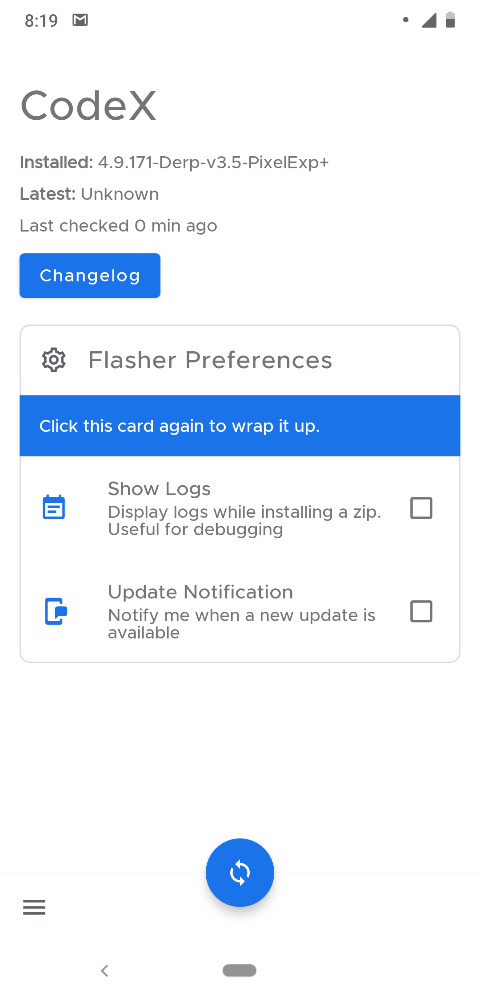 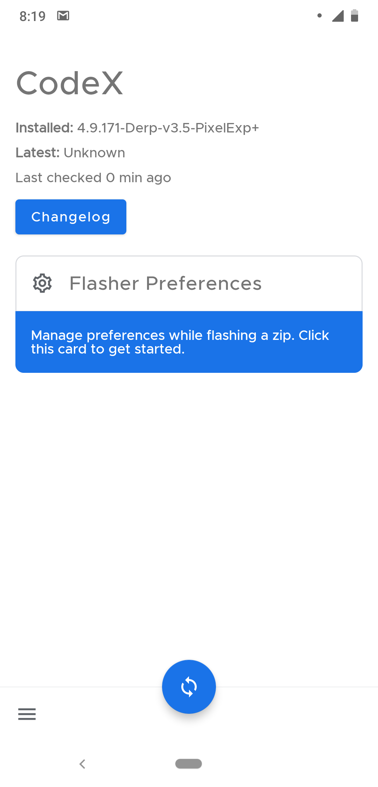 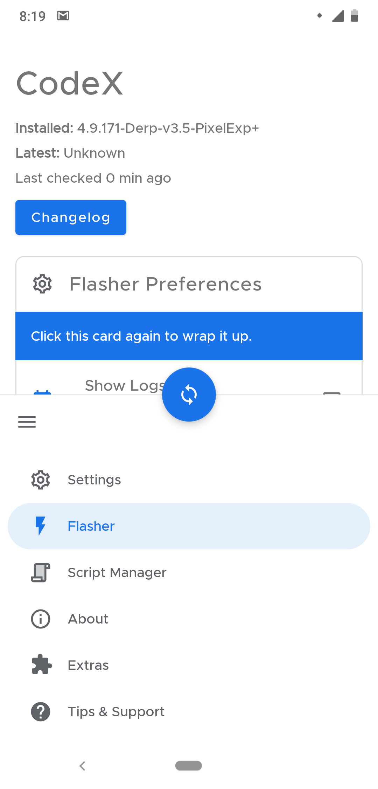 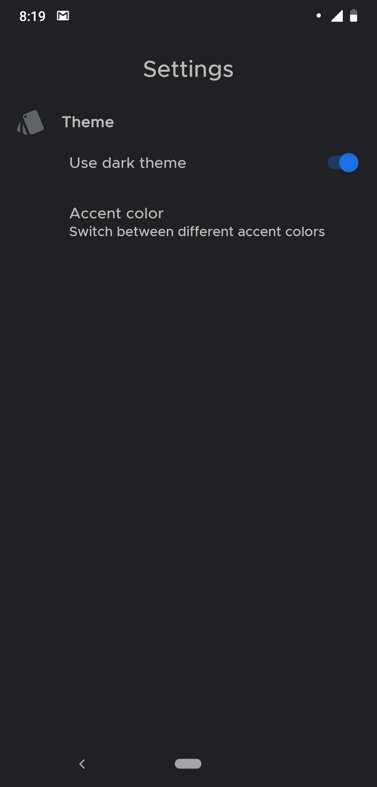 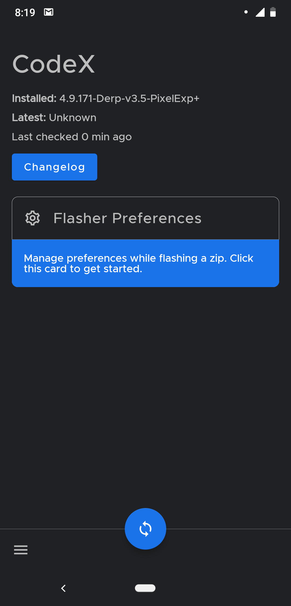 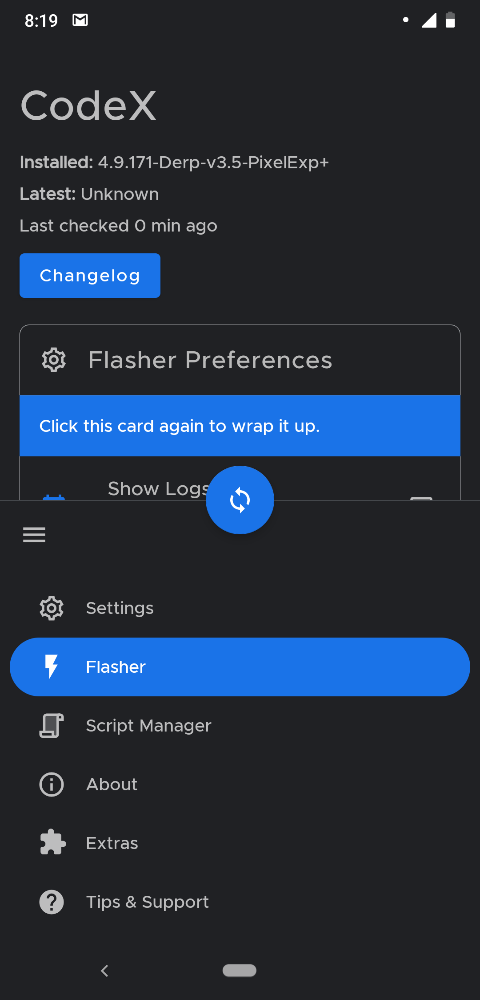  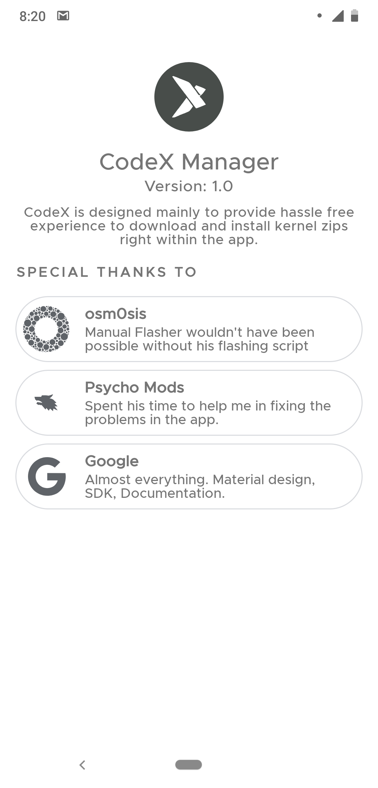 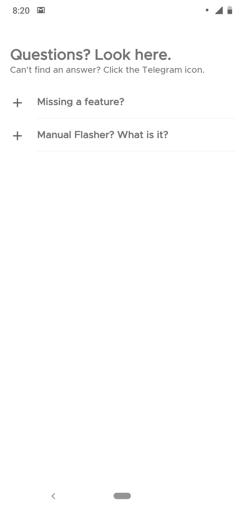 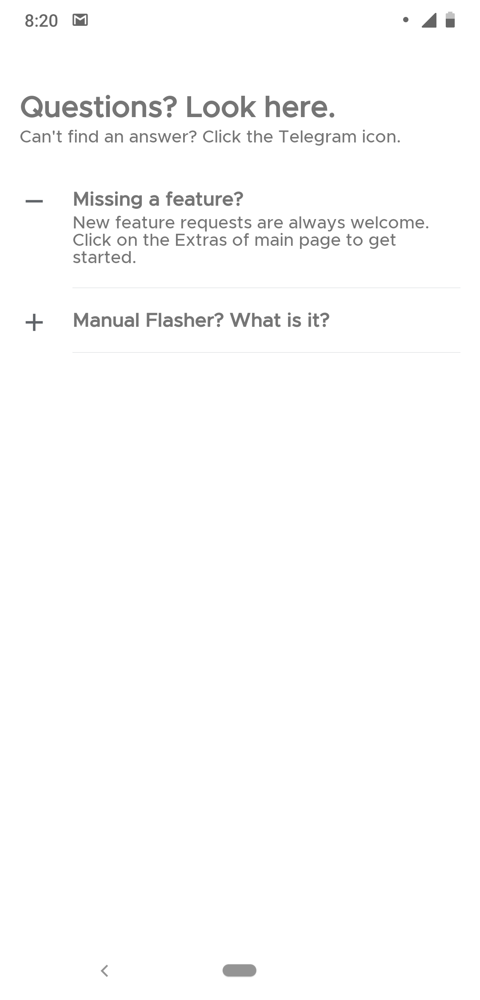 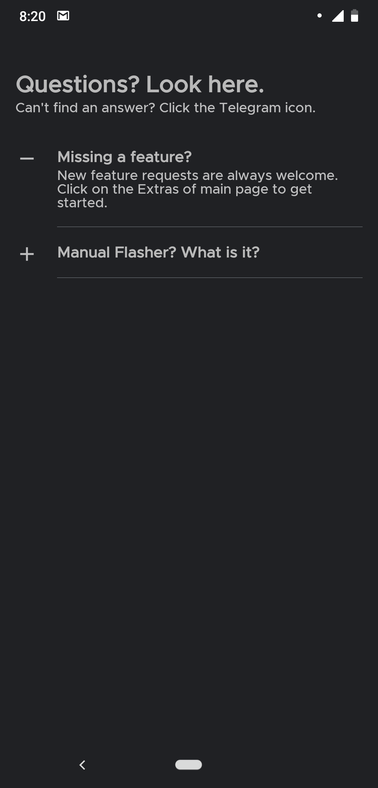 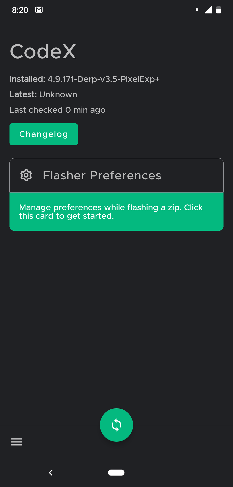 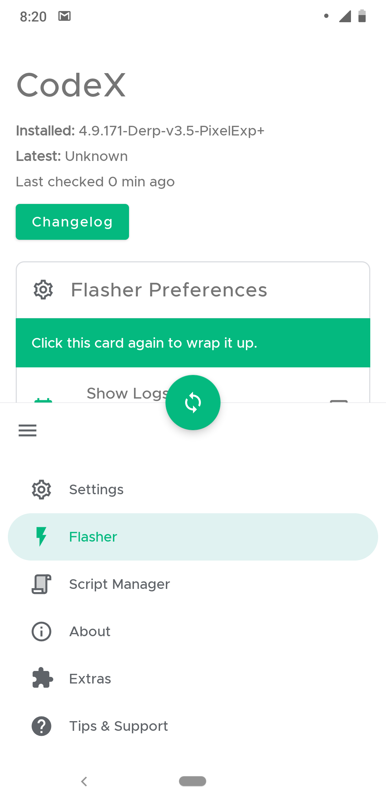
